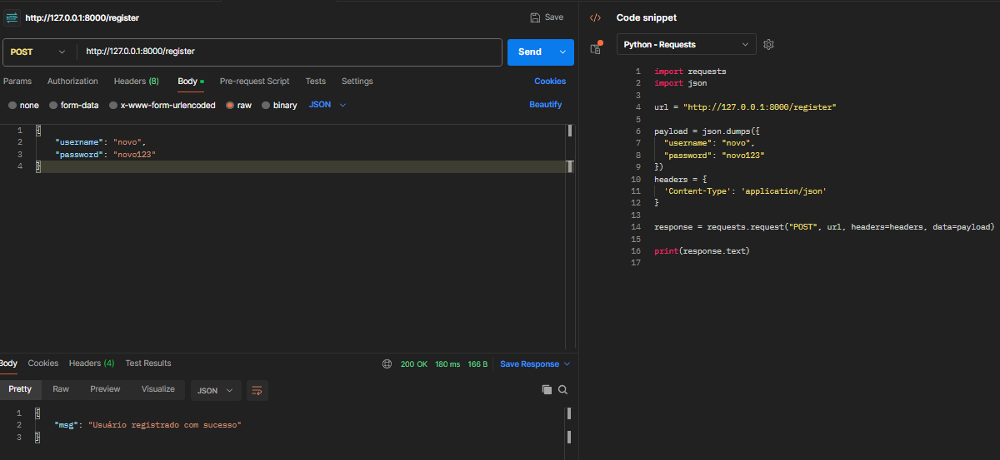
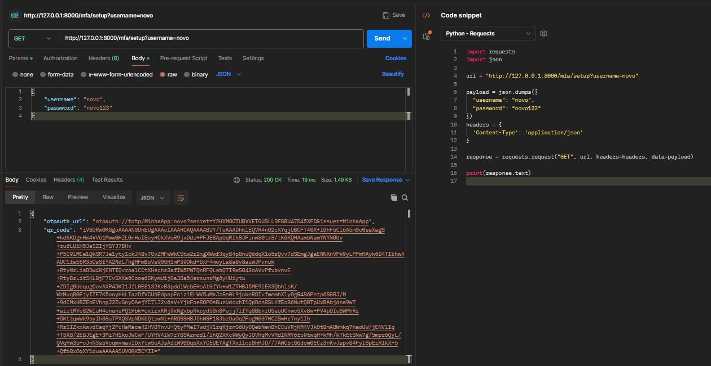
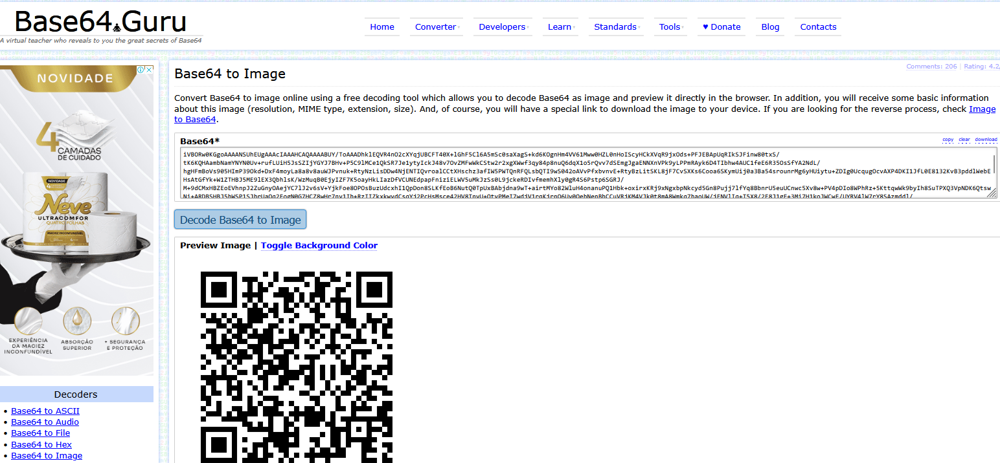
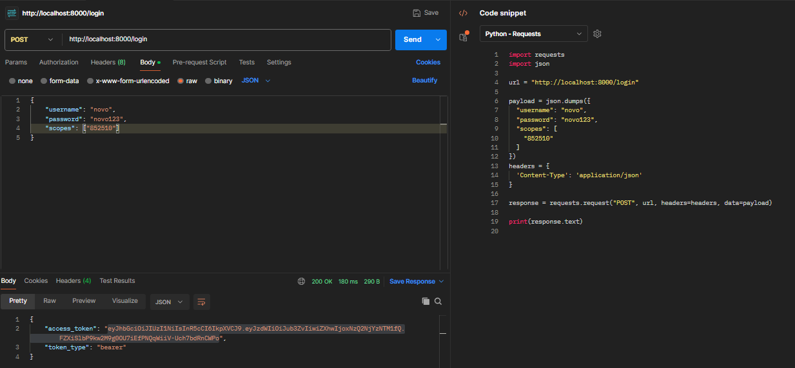
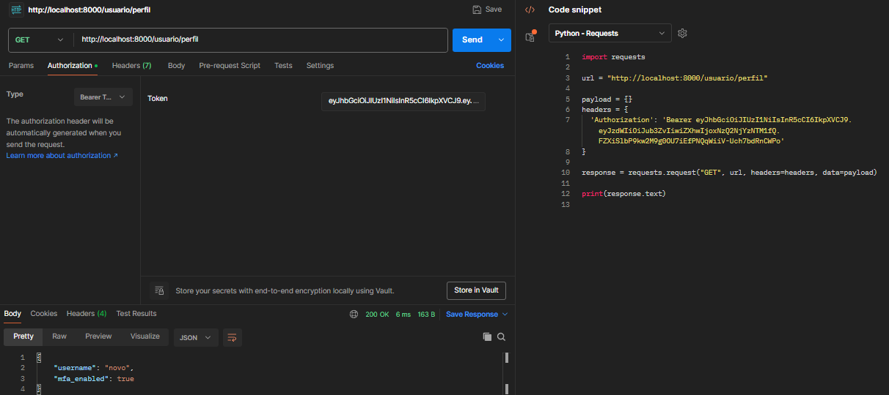
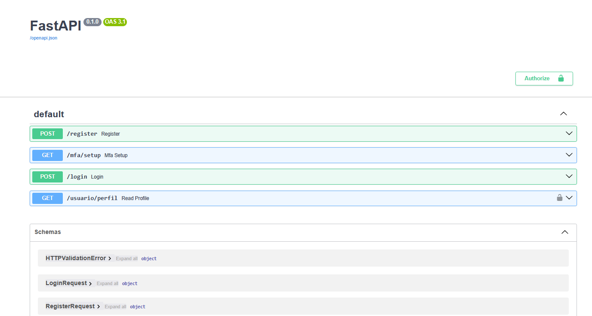

# 🔐 FastAPI Auth com JWT + MFA (TOTP)

Este projeto é uma API REST desenvolvida com **Python + FastAPI**, que implementa autenticação com **JWT** e **autenticação em dois fatores (2FA)** usando códigos TOTP compatíveis com **Google Authenticator**, **Authy**, entre outros.

## 📌 Funcionalidades

✅ Cadastro de usuários com senha criptografada (bcrypt)  
✅ Ativação de autenticação MFA com QR Code  
✅ Validação de login com senha e código TOTP  
✅ Geração de token JWT com validade de 1 hora  
✅ Endpoint protegido que requer token JWT  

---

## 🧰 Tecnologias e Bibliotecas Usadas

- [Pydantic](https://docs.pydantic.dev/latest/) - Validação de dados
- [FastAPI](https://fastapi.tiangolo.com/) - Criação de api python
- [Uvicorn](https://www.uvicorn.org/) - servidor ASGI
- [pyotp](https://pyauth.github.io/pyotp/) - para códigos TOTP (Google Authenticator)
- [python-jose](https://github.com/mpdavis/python-jose) - para geração/validação de JWT
- [passlib[bcrypt]](https://passlib.readthedocs.io/) - para hashing de senhas
- [qrcode](https://pypi.org/project/qrcode/) - para gerar QR Code
- [Pillow](https://pillow.readthedocs.io/) - para manipulação de imagem (usado com qrcode)

---

## 🚀 Como executar

1. **Clone o repositório**  
   ```bash
   git clone https://github.com/andrade-gabriel13/creator_qr_validator
   cd creator_qr_validator
   ```

2. **Crie um ambiente virtual e ative**  
   ```bash
   python -m venv venv
   source venv/bin/activate  # Linux/macOS
   venv\Scripts\activate     # Windows
   ```

3. **Instale as dependências**  
   ```bash
   pip install -r requirements.txt
   ```

4. **Rode a aplicação**  
   ```bash
   uvicorn main:app --reload
   ```

5. Acesse a documentação interativa em:
   ```
   http://localhost:8000/docs
   ```

---

## 📬 Endpoints da API

### 1. `POST /register`
**Cria um novo usuário**

**Body (JSON ou x-www-form-urlencoded):**
```json
{
  "username": "usuario",
  "password": "senha123"
}
```
**Exemplo do login (postman)**


---

### 2. `GET /mfa/setup?username=usuario`
**Gera um QR Code para MFA**

**Retorno:**
- `otpauth_url`: link para usar no Google Authenticator
- `qr_code`: string base64 de um QR Code (pode ser exibido em frontend)

---
**Exemplo do get usuário (postman)**


### 3. `POST /login`
**Realiza login com senha e (opcional) TOTP**

**Body:**
```json
{
  "username": "usuario",
  "password": "senha123",
  "totp": ["123456"]  // opcional se MFA desativado
}
```
**Exemplo do decode do código base64 para imagem (fonte externa)**
[Decodebas64](https://base64.guru/converter/decode/image)
**Usando o site para gerar o qrcode**



**Exemplo reutilizando o código do google autenticator**


**Retorno:** JWT válido por 1 hora

---

### 4. `GET /usuario/perfil`
**Recurso protegido. Necessário enviar o token no header:**

```http
Authorization: Bearer <seu_token>
```



### 5. Documentação com swagger
[Swagger](http://127.0.0.1:8000/docs)

**Parte das configurações**

